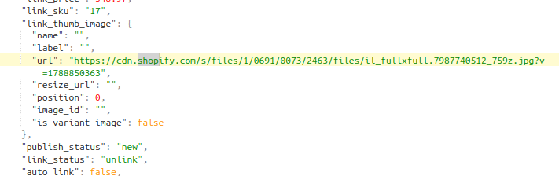
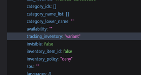
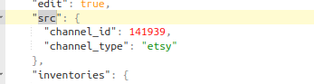
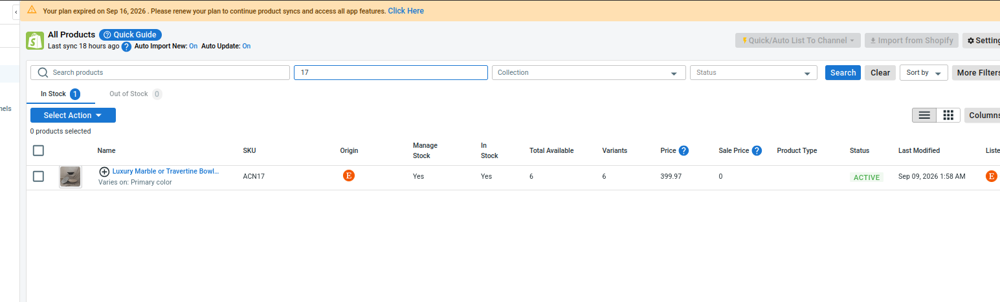
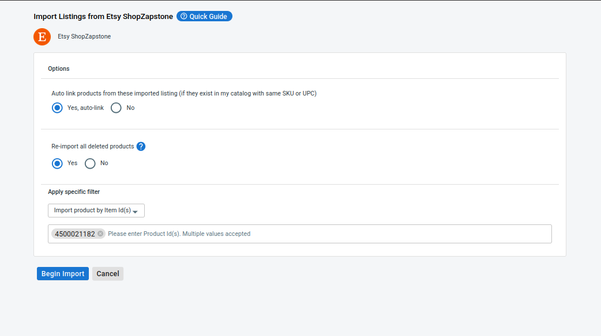
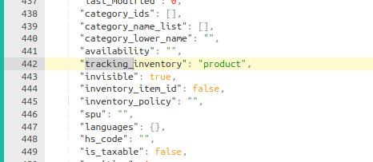

# Main Store
SHOPIFY
create on **12:12:58 day 07/09/2026 (Vietnam hour, GMT+7)**

Etsy sale channel created on ****06:29:44 day 08/09/2026 (Vietnam hour, GMT+7)**** 

So the product must be pull from Shopify and it's `tracking_inventory` must be `variant` when it pull from Shopify. And then it push to Etsy, it take no effect because. It tracking based on the parent product.

Main cause: the order code checks the Shopify product's setting, not Etsy's.

# Checking
This product **created_at: 2026-09-08T06:52:54Z**

# Tại sao lại xảy ra Bug này ?
Do khách thao tác.
1. Đầu tiên khách pull sản phẩm này ở Main Store trước ở Shoify mà Shopify thì maintain inventory_tracking dựa trên variant với mã số SKU 17.
Bằng chứng:

2. Rồi khách lại pull sản phẩm này từ sale channel Etsy. (Note: Những sản phẩm được pull từ Etsy thì maintain bằng inventory_tracking là product) và chọn Auto Link. Do sản phẩm với mã số SKU 17 này đã có trước nên nó chỉ link vào thôi mà ko sửa inventory_tracking thành product và vẫn dựa theo variant của bên Shopify.

3. Rồi khách quyết định xóa sản phẩm với mã số SKU 17 ở bên Main Store nên ko còn dấu tích gì nữa ở mainstore nhưng việc đó ko thay đổi inventory_tracking là variant như cũ. Nhưng hiện vẫn còn sản phẩm đó với mã số SKU 17 ở sale channel Etsy.

# Cách để fix:
1. CS bảo khách xóa sản phẩm đó ở Sale Channel Etsy
2. CS bảo khách import sản phẩm đó lại với cấu hình như sau. Mã số 4500021182 là mã số sản phẩm trên sàn Etsy với SKU 17.

3. Và check kết quả

